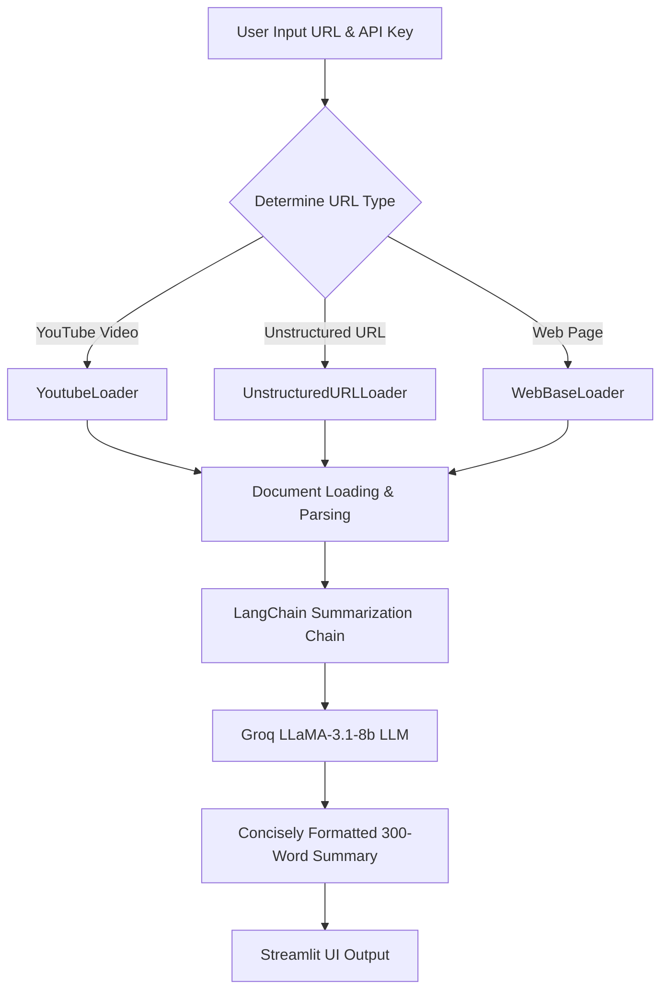

# 🔍 Summarization App using LangChain & Groq

A premium, interactive web application built with **Streamlit**, **LangChain**, and **Groq LLM** (`llama-3.1-8b-instant`). This application allows users to seamlessly extract and summarize content from any standard website URL or YouTube video into a concise, high-quality 300-word summary.

---

## 🌟 Features

- **Multi-Source Loading**:
  - 🎥 **YouTube Videos**: Automated transcript extraction and processing using LangChain's `YoutubeLoader`.
  - 🌐 **Web Pages**: Content extraction from standard web pages using `WebBaseLoader`.
  - 📄 **Unstructured URLs**: Advanced unstructured content extraction using `UnstructuredURLLoader`.
- **Groq LLaMA 3.1 Acceleration**: Powered by the blazing fast `llama-3.1-8b-instant` model.
- **Robust Error Handling**: Graceful fallback mechanism if YouTube transcript retrieval fails due to blocks or rate limits.
- **Vibrant UI/UX**: An interactive, responsive sidebar and main viewport with real-time spinners and status indications.

---

## ⚙️ How it Works



---

## 🚀 Quick Start

### 1. Prerequisites
Ensure you have Python 3.9+ installed on your system.

### 2. Clone and Navigate
If you haven't already, clone this repository and navigate to the project directory:
```bash
cd "summarization project"
```

### 3. Install Dependencies
Install all required libraries using `pip`:
```bash
pip install -r requirements.txt
```

### 4. Run the Streamlit Application
Start the local development server:
```bash
streamlit run app.py
```

---

## 🛠️ Requirements & Stack

The application relies on the following core dependencies:
- `streamlit` - Frontend interactive user interface
- `validators` - URL syntax validation
- `langchain` & `langchain-community` - LLM framework & document loaders
- `langchain-groq` - Official Groq integration
- `youtube-transcript-api` & `pytube` - Video transcript retrieval
- `beautifulsoup4` - Web scraping helper

---

## 🔒 Security & Best Practices

- **API Keys**: Your Groq API key is securely accepted via Streamlit's password input input in the sidebar and is processed completely in-memory (never logged or saved).
- **User-Agent Customization**: Uses simulated desktop headers to bypass restrictive firewalls on common web articles.
